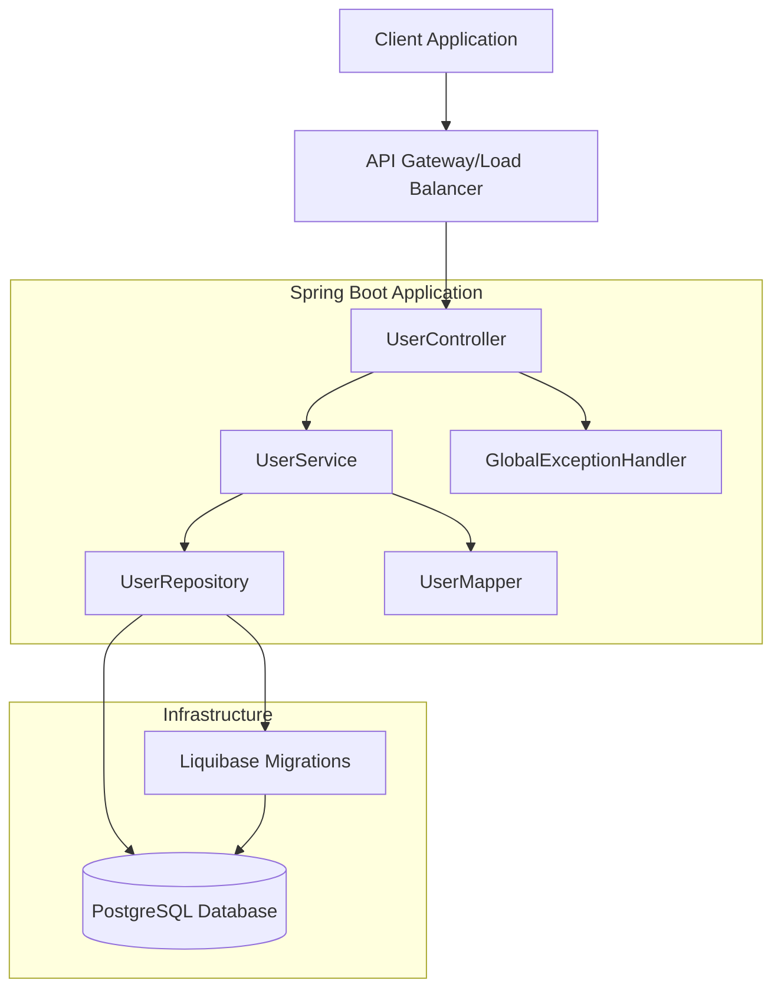
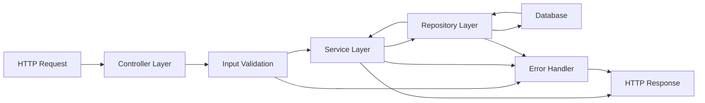
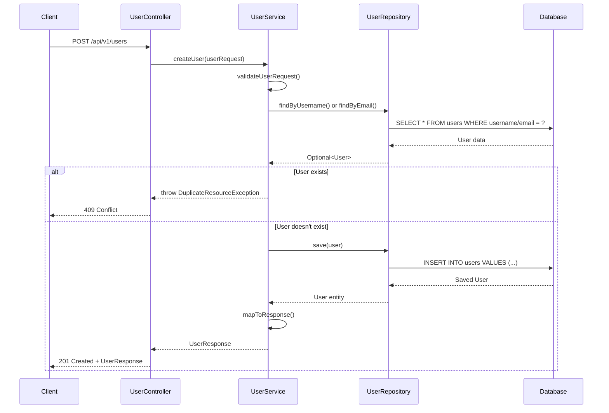
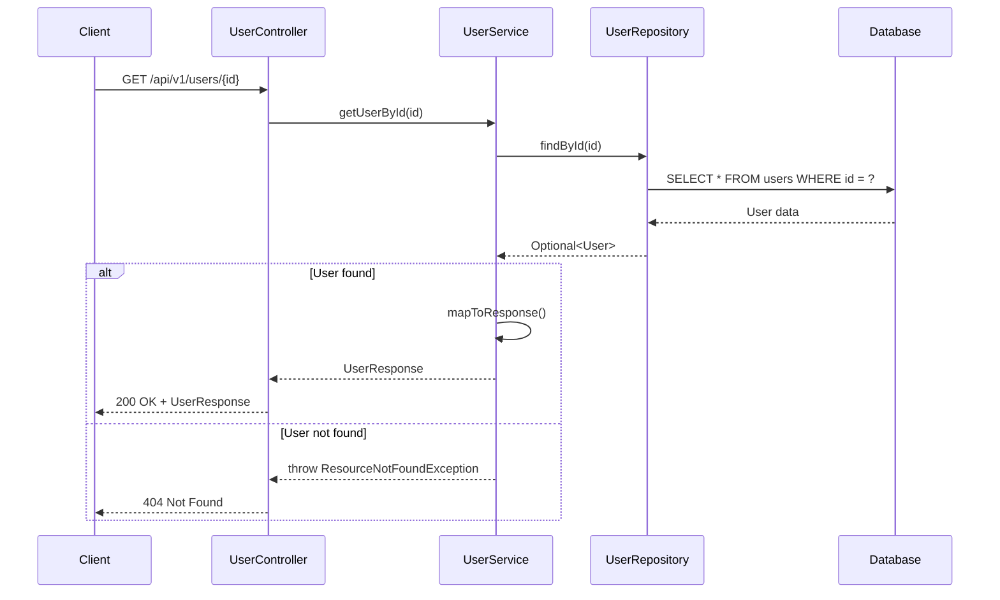
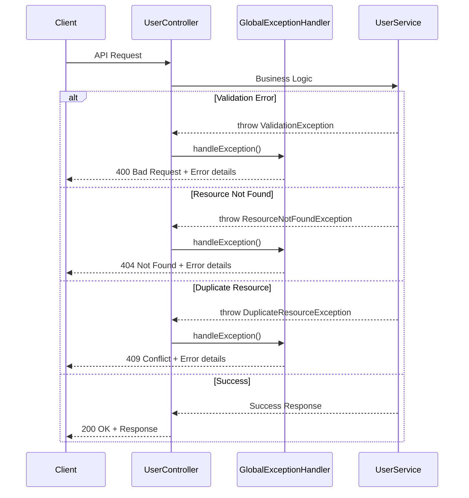
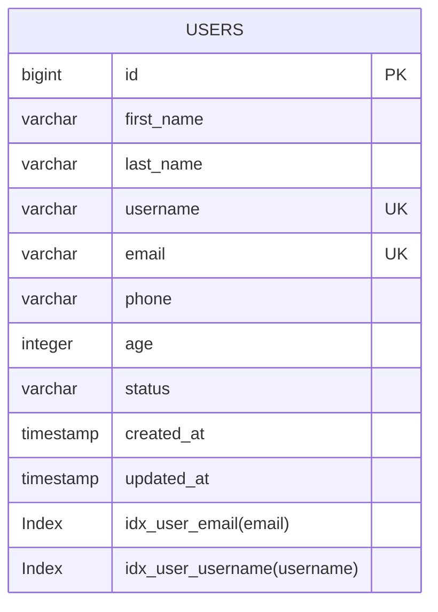
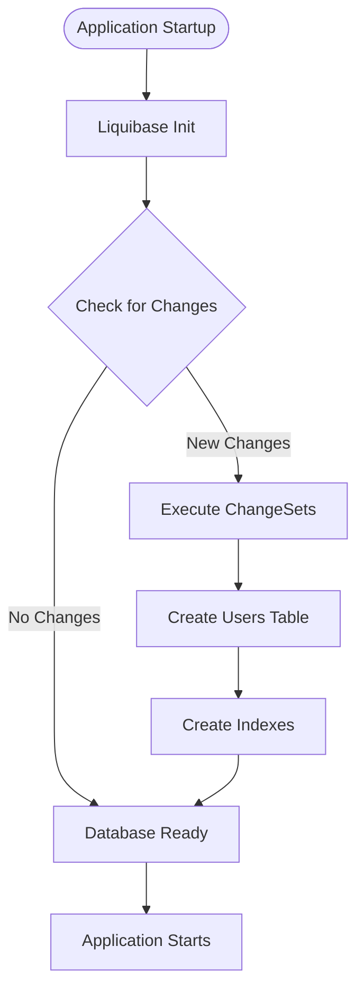
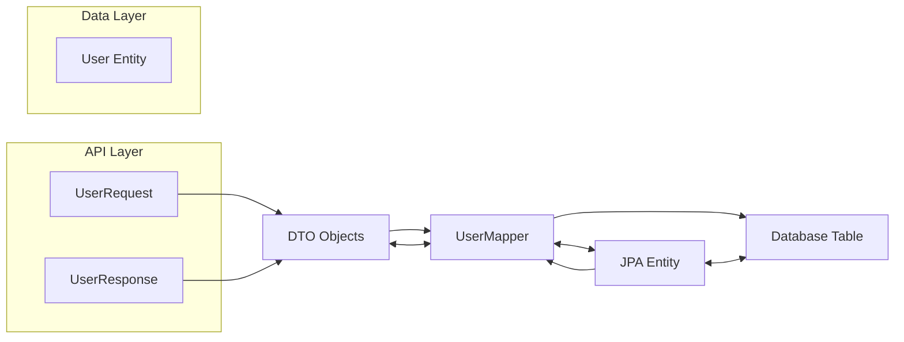

# User Management Microservice

A production-ready Spring Boot CRUD microservice for user management with comprehensive features.

## Features

- **CRUD Operations**: Complete Create, Read, Update, Delete operations for users
- **Validation**: Comprehensive input validation using Hibernate Validator
- **Pagination**: Support for paginated results with sorting
- **Search**: Full-text search across user fields
- **Exception Handling**: Global exception handling with proper HTTP status codes
- **Database**: PostgreSQL with Liquibase migrations
- **Monitoring**: Spring Boot Actuator endpoints
- **Clean Architecture**: Proper separation of concerns with layered architecture

## Architecture

```
├── controller/     # REST API endpoints
├── service/        # Business logic layer
├── repository/    # Data access layer
├── entity/        # JPA entities
├── dto/           # Data Transfer Objects
├── exception/     # Custom exceptions and global handler
└── mapper/        # Entity-DTO mapping utilities
```

### System Architecture Diagram



### Data Flow Architecture



## API Endpoints

### User Management
- `POST /api/v1/users` - Create a new user
- `GET /api/v1/users/{id}` - Get user by ID
- `GET /api/v1/users/username/{username}` - Get user by username
- `GET /api/v1/users/email/{email}` - Get user by email
- `GET /api/v1/users` - Get all users
- `GET /api/v1/users/paginated` - Get paginated users
- `GET /api/v1/users/search` - Search users
- `PUT /api/v1/users/{id}` - Update user
- `PATCH /api/v1/users/{id}/status` - Update user status
- `DELETE /api/v1/users/{id}` - Delete user

### Statistics
- `GET /api/v1/users/stats/total` - Get total users count
- `GET /api/v1/users/stats/status/{status}` - Get users count by status

## API Flow Diagrams

### Create User Flow


### Get User by ID Flow

```mermaid
flowchart TD
    Start([Start]) --> Request[GET /api/v1/users/{id}]
    Request --> FindUser{Find User in DB}
    FindUser -->|Not Found| Error404[404 Not Found]
    FindUser -->|Found| MapToDTO[Map Entity to DTO]
    MapToDTO --> Success[200 OK]
    Error404 --> End([End])
    Success --> End
```

## Sequence Diagrams

### Create User Sequence



### Get User by ID Sequence



### Error Handling Sequence



## Running the Application

### Prerequisites
- Java 21+
- PostgreSQL database
- Gradle

### Database Setup
1. Create PostgreSQL database: `user_service_db`
2. Update database credentials in `application.yml`

### Run with Gradle
```bash
./gradlew bootRun
```

### Run with Docker (optional)
```bash
docker build -t user-service .
docker run -p 8081:8081 user-service
```

## Configuration

The application runs on port `8081` by default. Key configuration options in `application.yml`:

- Database connection settings
- Server port
- Logging levels
- Management endpoints

## Validation Rules

- **First Name**: 2-50 characters, required
- **Last Name**: 2-50 characters, required
- **Username**: 3-30 characters, alphanumeric + underscores, unique
- **Email**: Valid email format, unique
- **Phone**: 10-20 characters, numeric
- **Age**: Optional integer
- **Status**: ACTIVE, INACTIVE, or SUSPENDED

## Error Handling

The service provides comprehensive error handling with proper HTTP status codes:

- `400 Bad Request` - Validation errors
- `404 Not Found` - Resource not found
- `409 Conflict` - Duplicate resource
- `500 Internal Server Error` - Unexpected errors

## Monitoring

Spring Boot Actuator endpoints are available:
- `/actuator/health` - Application health
- `/actuator/info` - Application info
- `/actuator/metrics` - Application metrics

## Testing

Run tests with:
```bash
./gradlew test
```

## Database Schema

### Entity Relationship Diagram



### Database Schema Flow



The `users` table includes:
- **Basic user information** (name, username, email, phone)
- **Optional fields** (age)
- **Status tracking** (ACTIVE, INACTIVE, SUSPENDED)
- **Audit fields** (created_at, updated_at)
- **Indexes for performance optimization**

### Data Mapping Flow


